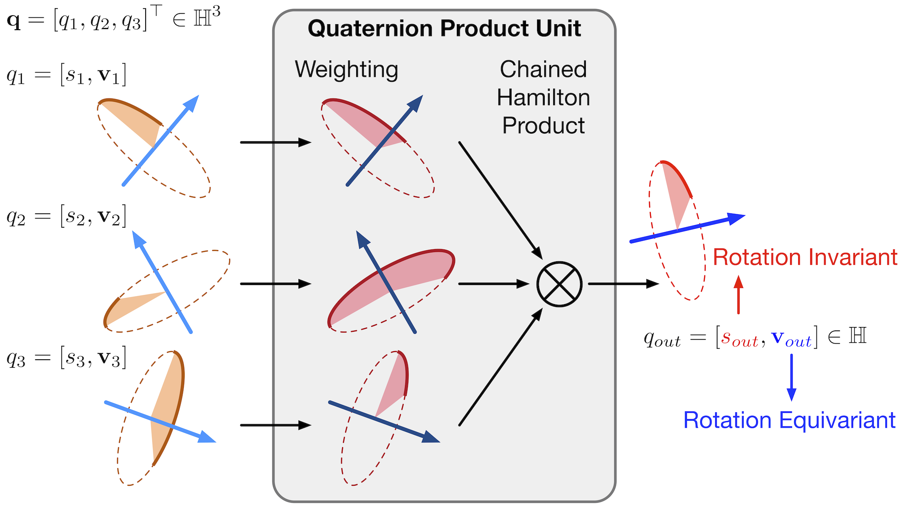

# Fast Quaternion Product Units for Learning Disentangled Representations in SO(3)

This is the code for the experiments of our TPAMI paper. You can find the published paper here: https://ieeexplore.ieee.org/abstract/document/9869301/.

<p align="center">

</p>

## Citation
```bib
@article{qin2022fast,
  title={Fast Quaternion Product Units for Learning Disentangled Representations in $$\backslash$mathbb $\{$SO$\}$(3) $},
  author={Qin, Shaofei and Zhang, Xuan and Xu, Hongteng and Xu, Yi},
  journal={IEEE Transactions on Pattern Analysis and Machine Intelligence},
  year={2022},
  publisher={IEEE}
}
```

## Installation

We use python3 with PyTorch >= 1.0. We also tqdm, tensorboardX, pyyaml for logging. If you use Anaconda, you can setup with:

```shell
conda install pytorch==1.7.1 torchvision==0.8.2 cudatoolkit=10.1 cudnn=7.6.5 -c pytorch
pip install tensorboardX pyyaml tqdm
```

We also use Jupyter Notebook and matplotlib for the synthetic data experiments.  

The code for the point cloud experiments in `pointcloud` is modified based on [Pointnet2_PyTorch](https://github.com/erikwijmans/Pointnet2_PyTorch). Please refer to the origin repository or `pointcloud/README.rst` for installation instructions.

### CUDA setup

Run commands `python setup.py build_ext --inplace` to setup. 

## Synthetic data experiments

Synthetic data experiments are in `CubeEdge/experiments.ipynb`.

## Real-world data experiments

###  Data generation

We use the  [FPHA](https://github.com/guiggh/hand_pose_action) dataset and the  [NTU RGB+D](https://github.com/shahroudy/NTURGB-D) dataset. Please refer to their respective project pages for permission and downloading. Data can also be visualized with scripts in `data/scripts`. Use the following commands to convert to our data formats.

**Generate the NTU  dataset:**

```bash
python data/scripts/ntu_gendata.py <dir of raw data> --mode xyz --bench <xview or xsub>
python data/scripts/ntu_gendata.py <dir of raw data> --mode qrel --bench <xview or xsub>
python data/scripts/gen_edge.py <dir of qrel data> --dataset ntu
```

Generated data is in `<dir of raw data>/../NTU-RGB-D/qrel`.

**Generate the FPHA dataset:**

```bash
python data/scripts/fpha_gendata.py <dir of raw data> --mode xyz
python data/scripts/fpha_gendata.py <dir of raw data> --mode qrel
python data/scripts/gen_edge.py <dir of qrel data> --dataset fpha
```

Generated data is in `<dir of raw data>/../fpha/qrel`.

### Training

```bash
python train.py configs/<config name>.yaml
```

You may specify the dataset or other parameters in the config file.

### Testing

First enter the correct dataset path in `config.test.yaml`. Then use the following command to test the trained model with (`<random rotate>=1`) or without (`<random rotate>=0`) random rotations.

```shell
python test.py <dir of model folder> <random rotate the input data ? True:1, Flase:0>
```


## Point cloud data experiments

Please refer to `pointcloud/PointNet++/README.rst` and `pointcloud/RSCNN/README.md`.

Different environment deployments may bring some trouble to your reproduction, and we are also working on this problem. In the next update we will merge these different tasks into the same framework, so stay tuned.
## Credits

Our DGNN-based models are implemented based on [Unofficial-DGNN-PyTorch](https://github.com/kenziyuliu/Unofficial-DGNN-PyTorch).

The code for our point cloud experiments is modified based on [Pointnet2_PyTorch](https://github.com/erikwijmans/Pointnet2_PyTorch) and  [Relation-Shape-CNN](https://github.com/Yochengliu/Relation-Shape-CNN) .

We thank the respective authors for sharing their work.